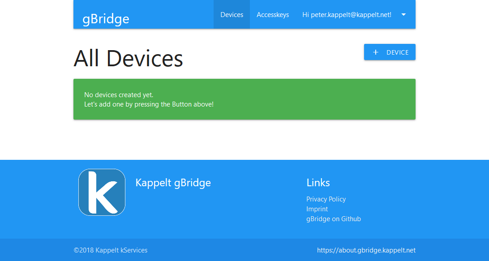

Getting Started
====================

.. NOTE::
   This manual is made with the hosted gBridge service. If you are running gBridge on your own servers, there might be some small differences. However, they can be easily adapted.

Register a new account
-----------------------
That's not complicated at all: just visit `https://gbridge.kappelt.net/register <https://gbridge.kappelt.net/register>`_ and fill in the required information. After you've received the confirmation email, you can instantly log in.

It might take up to 24 hours for your account to get fully activated during the beta phase, since some confirmations have to be done manually. You'll receive another mail once your account is fully set.

A first device
--------------------
You'll see your account's dashboard for the first time after logging in.

   Your dashboard

Press the top-right button labeled with "+ Device" to create a new one. Choose whatever you like. For this example, I've chosen "Light" as the type and both "On and Off" and "Brightness" as supported traits.

.. figure:: ../_static/dashboard-first-device.png
   :width: 100%
   :align: center
   :alt: alternate text
   :figclass: align-center

   Congratulations! You've just created your first virtual device.

Note the MQTT topics that are listed here.

Before we can move on to the Google Home app, you need to create an accesskey.

.. TIP::
   Accesskeys are one-time-passwords that can be used to link a gBridge account with the Google Home app.

To do so, open the tab "Accesskeys" and click on the add-button.

.. figure:: ../_static/dashboard-first-accesskey.png
   :width: 100%
   :align: center
   :alt: alternate text
   :figclass: align-center

   You'll need that accesskey later!

Connect Google Assistant
-----------------------------
Open the *Google Home App* to connect your Google Home system to gBridge. Navigate to the smart home settings and press the "Add" button to link your account. Select *Kappelt gBridge*.

.. figure:: ../_static/googlehome-add-provider.png
   :width: 50%
   :align: center
   :alt: alternate text
   :figclass: align-center

.. figure:: ../_static/googlehome-link-account.png
   :width: 50%
   :align: center
   :alt: alternate text
   :figclass: align-center

   Enter your email, use the accesskey that was generated before.

.. figure:: ../_static/googlehome-device-listed.png
   :width: 50%
   :align: center
   :alt: alternate text
   :figclass: align-center

   Your newly created devices will appear in the list. If you like, you can assign a room to the devices.

If you add new devices in your dashboard, they'll appear in the list automatically.

Test it
---------
Everything is ready now! Messages will now be available on gBridge's public MQTT server. You can connect to it:

:Hostname: mqtt.gbridge.kappelt.net
:Port: 1883
:Username: Shown in your account's dashboard under "My Account"
:Password: Shown in your account's dashboard under "My Account"
:TLS: Not yet supported

Subscribe now to the MQTT topic that belongs to your device, for example with *mosquitto_sub*:

.. code-block:: bash

   mosquitto_sub --username your-username \
      --pw your-password \
      --topic gBridge/u2/d4/onoff \
      --host mqtt.gbridge.kappelt.net

.. figure:: ../_static/googlehome-try-it.png
   :width: 100%
   :align: center
   :alt: alternate text
   :figclass: align-center

   A voice command leads to a published MQTT message.