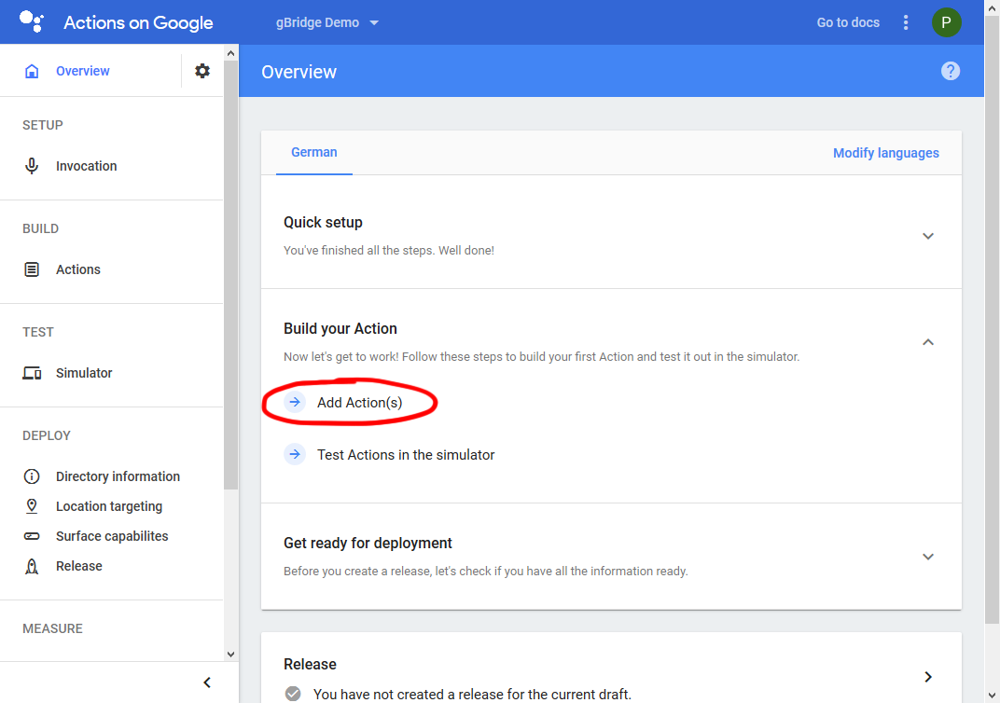
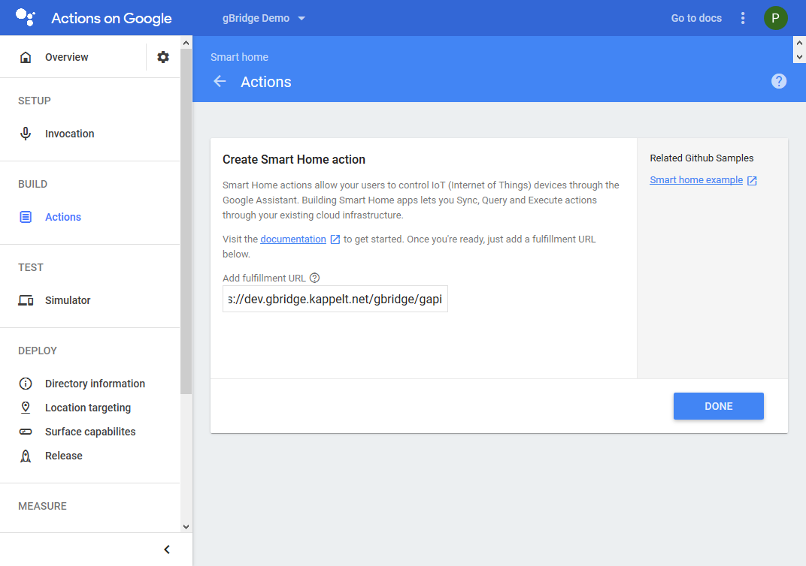
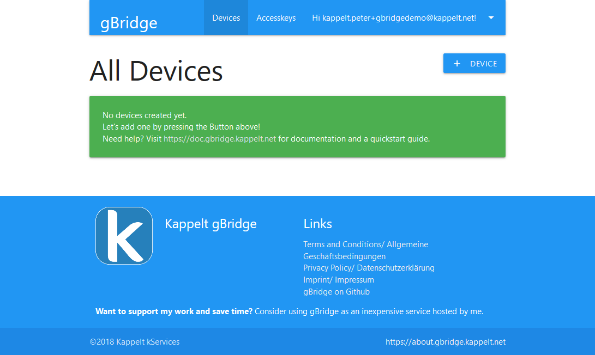

Self-Hosted gBridge
====================================

Prerequisites
----------------

The following points need to be satisfied in order to host your own instance of gBridge.

* **Availability of a (web-) server that is running constantly.** Docker needs to be installed. A Raspberry Pi should have plenty of power for this purpose.
* **A webserver is running, available and configured,** one needs to be available to access it publicly. A static domain (e.g. provided by a DDNS provider) has to be configured for your server, too. 
* **Your webserver needs to be configured for HTTPS.** A valid, signed certificate must be served via HTTPS. This should be no problem nowadays since one can get free certificates, e.g. from `Let's Encrypt <https://letsencrypt.org/>`_.
* **A MQTT server needs to available in your network.**

Set up Google Action
--------------------------------

This part will describe the process of creating a new Smart Home project in the Google Actions Console. Your new project will be listed as a smart home provider in the Google Home app, thus can be used in your own environment.

Create a new Project
~~~~~~~~~~~~~~~~~~~~~~~~~

Navigate to the `Google Actions Console <https://console.actions.google.com/>`_. Make sure you are logged in with the Google Account you are already using with Google Assistant.

.. figure:: ../_static/gproject-projectoverview.png
   :width: 100%
   :align: center
   :alt: Project Overview in Google Actions Console.
   :figclass: align-center

   You'll see this page after logging in to the Google Actions Console. Create a new project.

Choose a name
~~~~~~~~~~~~~~~~

Choose a generic name. Create the new project and select it to be a "Home control" application.

.. figure:: ../_static/gproject-newproject.png
   :width: 100%
   :align: center
   :alt: Setting the project's name.
   :figclass: align-center

   Choose the name for the project.

.. figure:: ../_static/gproject-newproject-category.png
   :width: 100%
   :align: center
   :alt: Selecting application category for the new project.
   :figclass: align-center

   Select "Home control" as the application type.

.. figure:: ../_static/gproject-newproject-overview.png
   :width: 100%
   :align: center
   :alt: Step-by-step page for the project setup.
   :figclass: align-center

   Set the name here again. Continue with the next step: Account linking

Set up account linking
~~~~~~~~~~~~~~~~~~~~~~~~~~~~

- Do not allow users to register accounts via voice.
- Select OAuth only with Implicit grants.
- Generate a random password for the client id. Avoid special chars. This can be long and difficult to remember, since you only need to enter it once later on.
- Use the following URL: :code:`https://YOUR-WEBSERVER'S-ADDRESS/gbrigde/gapi/auth`. For example: :code:`https://dev.gbridge.kappelt.net/gbrigde/gapi/auth`
- OAuth scopes are not required, leave them empty. You don't need to add a useful instruction for account linking either.

.. figure:: ../_static/gproject-accountlinking.png
   :width: 100%
   :align: center
   :alt: Set-up of account linking.
   :figclass: align-center

   Follow the steps above to set up account linking.

Add action fulfillment
~~~~~~~~~~~~~~~~~~~~~~~~~

- Go back to the overview page, select "Add Actions".
- Enter the following URL as the fulfillment URL: :code:`https://YOUR-WEBSERVER'S-ADDRESS/gbrigde/gapi`. For example: :code:`https://dev.gbridge.kappelt.net/gbrigde/gapi`

   Add a new action.

   Set the fulfillment URL for the new action.

Look for the project id
~~~~~~~~~~~~~~~~~~~~~~~~~~~~~

Note the project id, since it'll be necessary to known it later. It is shown in the project settings.

.. figure:: ../_static/gproject-projectid.png
   :width: 100%
   :align: center
   :alt: The project id is shown in the project settings.
   :figclass: align-center

   The project id is shown in the project settings.

Start simulator for synchronization
~~~~~~~~~~~~~~~~~~~~~~~~~~~~~~~~~~~~

Select "Simulator" in the left menu. Choose your own language there, click on "Start Testing". There is no need to do anything more here. This step is sometimes necessary for synchronization of the project options.

Enable the Homegraph API
~~~~~~~~~~~~~~~~~~~~~~~~~~~~~~~

- Navigate to the `Google Cloud Console <https://console.cloud.google.com/>`_
- Select your project in the top bar. Select "APIs and Services" in the left menu.
- Add a new API. Search for "Homegraph", select it and enable it afterwards.
- Open the left menu, select "APIs and Services", "Credentials" there.
- Select "Create credentials", "API Key". Note the new key.
- For safety reasons, select "Restrict key". Choose "HomeGraph API" as the only API restriction and save.

.. figure:: ../_static/gproject-homegraph.png
   :width: 100%
   :align: center
   :alt: Enable a new API for the project.
   :figclass: align-center

   Enable a new API for the project.

.. figure:: ../_static/gproject-homegraph-select.png
   :width: 100%
   :align: center
   :alt: Select the Homegraph API.
   :figclass: align-center

   Select the Homegraph API.

.. figure:: ../_static/gproject-homegraph-credentials.png
   :width: 100%
   :align: center
   :alt: Generate a new API Key.
   :figclass: align-center

   Generate a new API key in the credentials menu.

.. figure:: ../_static/gproject-homegraph-restrict.png
   :width: 100%
   :align: center
   :alt: Restrict the key to only work with the Homegraph API.
   :figclass: align-center

   Restrict the key to only work with the Homegraph API.

Set up gBridge in Docker
---------------------------------

Prerequisites
~~~~~~~~~~~~~~~~

Install both :code:`docker` and :code:`docker-compose` on your server, e.g. with your favourite package manager.

Generate Docker-Compose-File
~~~~~~~~~~~~~~~~~~~~~~~~~~~~~~~~~

A small script for generating individual Docker-Compose-Files for gBridge is available under `https://about.gbridge.kappelt.net/dockergen <https://about.gbridge.kappelt.net/dockergen>`_.

Fill in your information. Since a webserver is probably already running on your server, make sure to select a webserver port that is free.

Click on "Generate and Download" to download your individual docker-compose file. Save it in an new, empty directory (e.g. :code:`/opt/gbridge/`) on your server:

.. code-block:: bash

    sysop@kappelt:/opt/gbridge$ ls -al
    insgesamt 12
    drwxr-xr-x  2 root  root  4096 Aug 12 12:11 .
    drwxr-xr-x  5 root  root  4096 Aug 12 12:10 ..
    -rwxrwxrw-+ 1 sysop sysop 2176 Aug 12 12:09 docker-compose.yml

Starting gBridge for the first time
~~~~~~~~~~~~~~~~~~~~~~~~~~~~~~~~~~~~~~~~~

Navigate to the directory, run :code:`docker-compose up`. Depending on your account's permissions, you might need to run this as the root user.

Docker is going to download the necessary packages. A lot of lines will be displayed. Look for the following ones, they usually indicate a successfull startup:

*If you've chosen to use a docker database:*

.. code-block:: bash

    Creating gbridge_database_1 ... done
    ...
    database_1      | GENERATED ROOT PASSWORD: ZZZZ
    ...
    database_1      | MySQL init process done. Ready for start up.
    ...
    database_1      | 2018-08-12T10:19:26.111095Z 0 [Note] Event Scheduler: Loaded 0 events
    database_1      | 2018-08-12T10:19:26.112757Z 0 [Note] mysqld: ready for connections.
    database_1      | Version: '5.7.23'  socket: '/var/run/mysqld/mysqld.sock'  port: 3306  MySQL Community Server (GPL)

*If you've chosen to run Redis in docker:*

.. code-block:: bash

    cache_1         | 1:C 12 Aug 10:18:34.393 # oO0OoO0OoO0Oo Redis is starting oO0OoO0OoO0Oo
    cache_1         | 1:C 12 Aug 10:18:34.395 # Redis version=4.0.11, bits=64, commit=00000000, modified=0, pid=1, just started
    ...
    cache_1         | 1:M 12 Aug 10:18:34.400 * Ready to accept connections

*Always shown:*

.. code-block:: bash

    redis-worker_1  | MQTT client connected
    redis-worker_1  | Redis client (subscribe) connected
    redis-worker_1  | Redis client (cache) connected
    redis-worker_1  | Redis client (subscribe) successful subscribe to gbridge:u*:d*:*
    ...
    web_1           | [Sun Aug 12 10:18:48.685014 2018] [mpm_prefork:notice] [pid 1] AH00163: Apache/2.4.25 (Debian) PHP/7.2.8 configured -- resuming normal operations
    web_1           | [Sun Aug 12 10:18:48.685345 2018] [core:notice] [pid 1] AH00094: Command line: 'apache2 -D FOREGROUND'

If you got all lines and no obvious errors are visible, stop the containers by pressing :code:`Ctrl + C` once.

Start containers in background
~~~~~~~~~~~~~~~~~~~~~~~~~~~~~~~~~

..by running :code:`docker-compose up --detach`:

.. code-block:: bash

    sysop@kappelt:/opt/gbridge$ docker-compose up --detach
    Starting gbridge_database_1 ... done
    Starting gbridge_cache_1    ... done
    Starting gbridge_redis-worker_1 ... done
    Starting gbridge_web_1          ... done

You can now view the container's log files by navigating to gBridge's directory and running :code:`docker-compose logs`.

To stop the containers, navigate into gBridge's directory and run :code:`docker-compose stop`.

Prepare the database
~~~~~~~~~~~~~~~~~~~~~~~

Make sure the containers are running.

Navigate into gBridge's directory, run :code:`docker-compose exec web php artisan migrate`. Type "yes" as a confirmation, enter your mail once prompted.

.. code-block:: bash

    sysop@kappelt:/opt/gbridge$ sudo docker-compose exec web php artisan migrate
    **************************************
    *     Application In Production!     *
    **************************************

    Do you really wish to run this command? (yes/no) [no]:
    > yes

    Migration table created successfully.
    Enter your E-Mail address: kappelt.peter+gbridgedemo@kappelt.net
    A new user with the mail "kappelt.peter+gbridgedemo@kappelt.net" and the password "123456" has been created.
    Please change the password immediately!

    Migrating: 2014_10_12_000000_create_users_table
    ...

Open the web interface
~~~~~~~~~~~~~~~~~~~~~~~~~~

Navigate to the docker host's ip in your webbrowser, use the port you've entered for the web interface. In my case, the host's IP address is :code:`192.168.2.49` and I've chosen the port :code:`8080`.

You should see the login screen:

.. figure:: ../_static/webinterface-login.png
   :width: 100%
   :align: center
   :alt: Login screen of your gBridge instance.
   :figclass: align-center

   Login screen of your gBridge instance.

Log in using the mail you've entered during database setup and the password :code:`123456`.

You should now see the empty account dashboard:

   The first page after logging in.

.. warning::
    **Immediately** change your password under "Hi {YOUR-MAIL}", "My Account".

Configure your webserver
--------------------------------

TBD.

Test it
----------------

TBD.